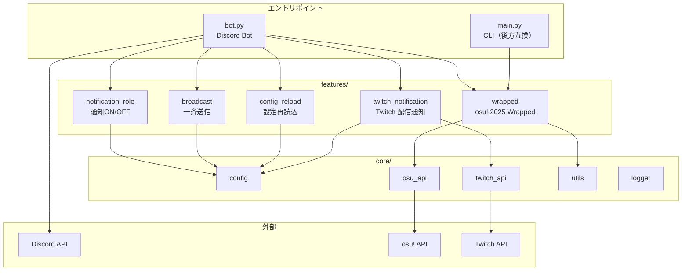
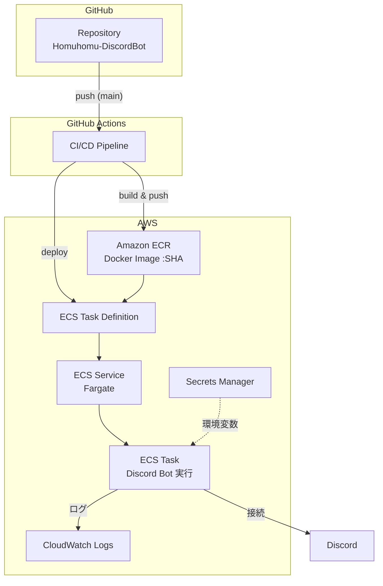
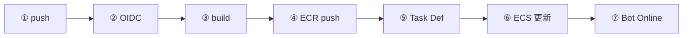
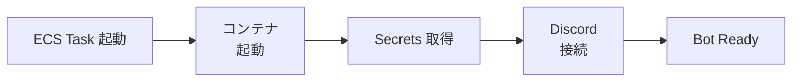
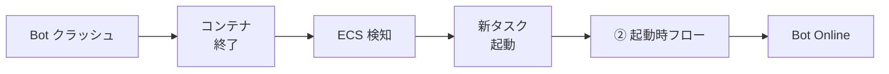
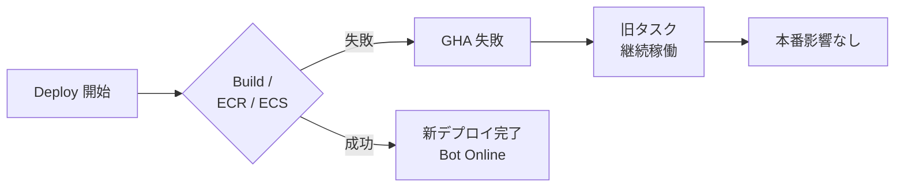
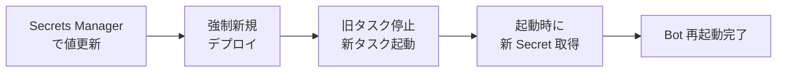
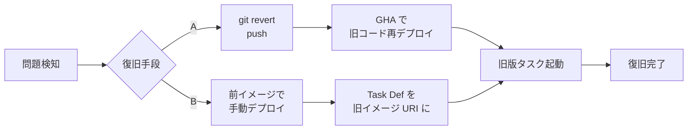

## 🧩 システム構成概要

- **言語**: Python 3.11
- **実行基盤**: AWS ECS Fargate
- **CI/CD**: GitHub Actions（OIDC）
- **コンテナ管理**: Amazon ECR
- **認証情報管理**: AWS Secrets Manager
- **ログ管理**: Amazon CloudWatch Logs

---

## Bot アーキテクチャ

Discord Bot アプリケーションのコード構成と、Discord / 外部 API との関係。



| レイヤー | 役割 |
|----------|------|
| **bot.py** | `commands.Bot` のエントリ。スラッシュコマンド登録、`on_ready` で View 登録・Twitch タスク起動。`main.py` は CLI 用（wrapped のみ） |
| **features/** | 機能ごとに `commands`（+ `data` / `embeds` / `tasks`）。`wrapped` は osu!、`twitch_notification` は `TwitchNotificationTask` でポーリング |
| **core/** | 共通: `config`（環境変数）、`osu_api` / `twitch_api`、`utils`、`logger` |

---

## デプロイアーキテクチャ図

コンポーネント構成と接続関係（インフラ・CI/CD）。



---

## CI/CD フロー図

`main` への push から Bot 稼働までの処理順序。



| ステップ | 内容 |
|----------|------|
| ① | `main` へ push |
| ② | OIDC で AWS AssumeRole |
| ③ | Docker build |
| ④ | ECR へ push（イメージ `:commit-SHA`） |
| ⑤ | Task Definition 生成（イメージ URI 差し替え） |
| ⑥ | ECS Service 更新（新タスク定義でデプロイ） |
| ⑦ | タスク起動、Discord Bot Online |

---

## 運用フロー図

### ① 通常運用フロー（コード変更 → 自動デプロイ）


| ステップ | 説明 |
|----------|------|
| コード変更 | `main` 向けに PR merge または直接 push |
| push | `main` への push で `deploy.yml` がトリガー |
| GHA 起動 | OIDC → build → ECR push → Task Def 生成 → ECS Service 更新 |
| ECS 更新 | 新タスク定義でデプロイ、`wait-for-service-stability` で安定化まで待機 |
| 新タスク起動 | 新コンテナが起動し、旧タスクが Drain 後に停止 |
| Bot Online | 新タスクから Discord に再接続、稼働継続 |

---

### ② 起動時フロー（Task 起動 〜 Bot Ready）



| ステップ | 説明 |
|----------|------|
| ECS Task 起動 | Fargate がコンテナ用リソースを確保し `docker run` 相当を実行 |
| コンテナ起動 | `python bot.py` 開始。Execution Role で Secrets Manager から環境変数を注入 |
| Secrets 取得 | `DISCORD_BOT_TOKEN` 等を環境変数として利用可能に |
| Discord 接続 | Discord Gateway に接続、オフライン → オンラインに遷移 |
| Bot Ready | コマンド・イベント処理が可能な状態 |

---

### ③ 障害時フロー（Bot クラッシュ）



| ステップ | 説明 |
|----------|------|
| Bot クラッシュ | 未処理例外・OOM・プロセス終了などでコンテナが exit |
| コンテナ終了 | 終了コードでコンテナ停止、タスクが STOPPED に |
| ECS 検知 | Service の `desiredCount` と実タスク数を比較し不足を検知 |
| 新タスク起動 | 同一タスク定義で新タスクを起動（② 起動時フローと同じ） |
| Bot Online | 新タスクから Discord に再接続、自動復旧 |

---

### ④ デプロイ失敗時フロー（安全装置）



| ステップ | 説明 |
|----------|------|
| Deploy 開始 | push に伴い GHA の build / ECR push / ECS 更新のいずれかを実行 |
| 失敗 | ビルドエラー、ECR  push 失敗、ECS の安定化失敗（unhealthy 等） |
| GHA 失敗 | ワークフローが失敗、該当ジョブが赤くなる |
| 旧タスク継続 | ECS のデプロイが完了していなければ**既存タスクはそのまま**。新タスク定義への切り替えは行われない |
| 本番影響なし | 壊れたイメージ・定義が本番に反映されず、現行 Bot が稼働し続ける |

---

### ⑤ Secrets 更新フロー（コード変更なし）



| ステップ | 説明 |
|----------|------|
| Secrets Manager で値更新 | コンソール or CLI で Token / API Key などを更新 |
| 強制新規デプロイ | ECS コンソールで「新しいデプロイの強制」を実行。タスク定義の変更は不要 |
| 旧タスク停止 / 新タスク起動 | 実行中タスクが停止し、新タスクが起動。**起動時**に Secrets を再取得するため新値が反映される |
| 起動時に新 Secret 取得 | 新タスクの初回起動で Secrets Manager から最新値を取得 |
| Bot 再起動完了 | 新認証情報で Discord 等に再接続、稼働再開 |

> **注意**: 実行中タスクは Secret の「起動時コピー」を持つだけなので、SM を更新しても**再起動するまで**新値は反映されない。

---

### ⑥ ロールバックフロー（即時復旧）



| 手段 | 手順 |
|------|------|
| **A. revert push** | 問題のコミットを `git revert` して `main` に push → 通常の deploy が走り、**revert 済みコード**の新イメージで ECS が更新される |
| **B. 前イメージで手動デプロイ** | 1) ECR で前回正常だったイメージの URI（`:commit-SHA`）を確認<br/>2) `ecs/task-definition.json` の `image` をその URI に一時変更するか、AWS CLI で「前イメージを指定したタスク定義」を登録<br/>3) ECS Service をそのタスク定義で更新し「強制新規デプロイ」 |

| ステップ | 説明 |
|----------|------|
| 問題検知 | デプロイ後の不具合・Discord 側エラー・CloudWatch ログなどで異常を検知 |
| 復旧手段 | 上記 A または B を選択。B はコードを触らず、過去の「動いていた」イメージへ戻す場合に利用 |
| 旧版タスク起動 | 旧コード／旧イメージのタスクが起動し、Discord Bot が正常動作する状態に戻る |
| 復旧完了 | 事後で原因修正し、改めて `main` に push してデプロイする |

---

## 全体図（テキスト）

```text
┌──────────────────────────────┐
│          GitHub               │
│  Repository (Homuhomu-DiscordBot)
│                                │
│  - bot.py                      │
│  - Dockerfile                  │
│  - ecs/task-definition.json    │
│  - .github/workflows/deploy.yml│
└───────────────┬──────────────┘
                │ push (main)
                ▼
┌──────────────────────────────┐
│        GitHub Actions          │
│  CI / CD Pipeline              │
│                                │
│  1. OIDCでAWS AssumeRole       │
│  2. Docker build               │
│  3. ECRへpush (commit SHA)     │
│  4. Task Definition生成        │
│  5. ECS Service更新            │
└───────────────┬──────────────┘
                │
                ▼
┌──────────────────────────────┐
│           AWS                 │
│                                │
│  ┌────────────────────────┐  │
│  │        Amazon ECR       │  │
│  │  Docker Image Registry  │  │
│  │  - homuhomu-discord-bot │  │
│  │    :<commit SHA>        │  │
│  └───────────┬────────────┘  │
│              │                │
│              ▼                │
│  ┌────────────────────────┐  │
│  │   ECS Task Definition   │  │
│  │  (Git管理・自動生成)    │  │
│  │                          │ │
│  │  - Image URI (SHA)       │ │
│  │  - CPU / Memory          │ │
│  │  - Secrets ARN           │ │
│  │  - Log設定               │ │
│  └───────────┬────────────┘  │
│              │                │
│              ▼                │
│  ┌────────────────────────┐  │
│  │   ECS Service           │  │
│  │  (Fargate)              │  │
│  │                          │ │
│  │  - desiredCount = 1     │  │
│  │  - 自動再起動            │  │
│  └───────────┬────────────┘  │
│              │                │
│              ▼                │
│  ┌────────────────────────┐  │
│  │   ECS Task (Fargate)    │  │
│  │  Discord Bot 実行       │  │
│  │                          │  │
│  │  環境変数：              │  │
│  │   - DISCORD_BOT_TOKEN   │  │
│  │   - OSU / Twitch etc.   │  │
│  │                          │  │
│  │  ログ → CloudWatch Logs │  │
│  └───────────┬────────────┘  │
│              │                │
│              ▼                │
│  ┌────────────────────────┐  │
│  │   CloudWatch Logs       │  │
│  │  /ecs/homuhomu-...      │  │
│  │  - 起動ログ             │  │
│  │  - エラーログ           │  │
│  └────────────────────────┘  │
│                                │
│  ┌────────────────────────┐  │
│  │   Secrets Manager       │  │
│  │  - Discord Bot Token    │  │
│  │  - API Keys             │  │
│  └────────────────────────┘  │
└──────────────────────────────┘
                │
                ▼
┌──────────────────────────────┐
│          Discord              │
│  - Bot Online                 │
│  - コマンド応答               │
│  - イベント処理               │
└──────────────────────────────┘
```
## ディレクトリ構造


```
osu2025-wrapped/
├── bot.py                    # Discord Botのメインエントリーポイント
├── main.py                   # コマンドライン版のエントリーポイント（後方互換性のため残存）
├── requirements.txt          # Python依存パッケージ
├── .env                      # 環境変数（gitignore対象）
├── .env.example              # 環境変数のサンプル（.gitignore対象）
├── README.md                 # プロジェクトの概要とセットアップ
├── documents/                # ドキュメントディレクトリ
│   ├── README.md            # 詳細なREADME
│   └── PROJECT_STRUCTURE.md # このファイル（プロジェクト構造と実装方針）
│
├── core/                     # コア機能・共通ライブラリ
│   ├── __init__.py
│   ├── osu_api.py           # osu! APIクライアント（main.pyから移行予定）
│   ├── utils.py             # ユーティリティ関数（フォーマット、計算など）
│   └── config.py            # 設定管理
│
├── features/                 # 機能ごとのディレクトリ
│   ├── __init__.py
│   │
│   ├── wrapped/              # osu! 2025 Wrapped機能
│   │   ├── __init__.py
│   │   ├── commands.py      # スラッシュコマンド定義
│   │   ├── embeds.py        # Embed作成ロジック
│   │   └── data.py          # データ取得・処理ロジック
│   │
│   └── [将来の機能]/         # 例: beatmap_search, user_stats, etc.
│       ├── __init__.py
│       ├── commands.py
│       ├── embeds.py
│       └── data.py
│
└── tests/                    # テストコード（将来追加予定）
    ├── __init__.py
    ├── test_core/
    └── test_features/
```

## 実装方針

### 1. モジュール化の原則

- **機能ごとに独立したモジュール**: 各機能は`features/`配下の独自ディレクトリに配置
- **コア機能の分離**: 共通で使用される機能（APIクライアント、ユーティリティなど）は`core/`に配置
- **依存関係の明確化**: 機能間の依存は最小限にし、`core/`を通じて共通機能を使用

### 2. コード構成パターン

各機能ディレクトリは以下のファイル構成を推奨します：

```
features/[機能名]/
├── __init__.py           # モジュールの公開API
├── commands.py           # Discordスラッシュコマンド定義
├── embeds.py            # Discord Embed作成ロジック
├── data.py              # データ取得・処理ロジック
└── models.py            # データモデル（必要に応じて）
```

**責務の分離**:
- `commands.py`: Discordコマンドのインターフェース、エラーハンドリング、レスポンス
- `embeds.py`: Discord Embedのフォーマットとスタイリング
- `data.py`: API呼び出し、データ処理、ビジネスロジック

### 3. 命名規則

- **ディレクトリ名**: `snake_case`（例: `wrapped`, `beatmap_search`）
- **ファイル名**: `snake_case`（例: `commands.py`, `osu_api.py`）
- **クラス名**: `PascalCase`（例: `OsuAPIClient`, `WrappedCommand`）
- **関数名**: `snake_case`（例: `get_user_stats`, `create_wrapped_embed`）
- **定数**: `UPPER_SNAKE_CASE`（例: `BASE_URL`, `MAX_RESULTS`）

### 4. コマンド追加の手順

新しい機能（コマンド）を追加する場合：

1. **ディレクトリ作成**: `features/[機能名]/`を作成
2. **必要ファイルの作成**: `__init__.py`, `commands.py`, `embeds.py`, `data.py`
3. **コマンド実装**: `commands.py`にスラッシュコマンドを定義
4. **Botへの登録**: `bot.py`でコマンドをインポートして登録

**例: 新しい機能「beatmap_search」を追加する場合**

```python
# features/beatmap_search/commands.py
from discord import app_commands
from discord.ext import commands
from .data import search_beatmap
from .embeds import create_beatmap_embed

@commands.hybrid_command(name="beatmap")
@app_commands.describe(query="検索クエリ")
async def beatmap_command(ctx: commands.Context, query: str):
    """譜面を検索する"""
    await ctx.defer()
    
    try:
        beatmap_data = await search_beatmap(query)
        embed = create_beatmap_embed(beatmap_data)
        await ctx.send(embed=embed)
    except Exception as e:
        await ctx.send(f"❌ エラー: {str(e)}")

# bot.py
from features.beatmap_search.commands import beatmap_command
bot.add_command(beatmap_command)
```

### 5. 共通機能の使用

`core/`配下の機能は、すべての機能から使用できます：

```python
# features/wrapped/data.py
from core.osu_api import OsuAPIClient
from core.config import get_osu_credentials

def get_user_stats(username: str):
    client_id, client_secret = get_osu_credentials()
    client = OsuAPIClient(client_id, client_secret)
    # ...
```

### 6. 設定管理

環境変数や設定は`core/config.py`で一元管理：

```python
# core/config.py
import os
from dotenv import load_dotenv

load_dotenv()

def get_osu_credentials():
    return (
        os.getenv('OSU_CLIENT_ID'),
        os.getenv('OSU_CLIENT_SECRET')
    )

def get_discord_token():
    return os.getenv('DISCORD_BOT_TOKEN')
```

### 7. エラーハンドリング

- **APIエラー**: `core/osu_api.py`で統一的なエラーハンドリング
- **コマンドエラー**: 各`commands.py`でユーザーフレンドリーなエラーメッセージを返す
- **ログ出力**: エラーは必ずログに記録（将来、ロギングライブラリを導入予定）

### 8. 非同期処理

- **API呼び出し**: 長時間かかる可能性があるため、`asyncio`を使用して非同期実行
- **コマンド処理**: Discord Botのコマンドは全て`async/await`を使用
- **デファー**: レスポンスに時間がかかる場合は`ctx.defer()`または`interaction.response.defer()`を使用
